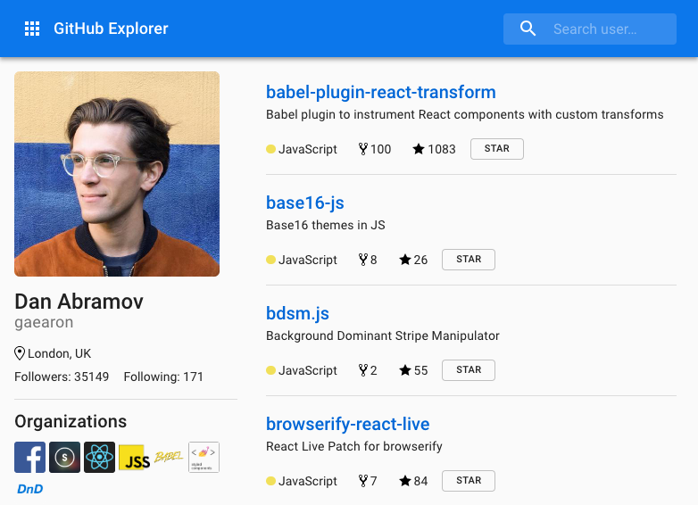

GitHub Explorer
===============
This application demonstrates the use of GitHub's GraphQL API. It is based on Chris Toomey's excellent talk at React Boston 2018. I am using a slightly different tech stack and UI design than his (Material UI, mobx-state-router), but the basic idea is the same. You can access Chris' original code [here](https://github.com/christoomey/boston-react-conf-2018-graphql-talk).



Getting Started
---------------
To run this app, you will need to generate a [GitHub personal access token](https://github.com/settings/tokens). Select the following scopes for your token: public_repo, read:org. Store the generated token in the `.env` file. Then follow the steps below:

```bash
$ yarn
$ yarn start
```

Now point your browser to http://localhost:3000/.
